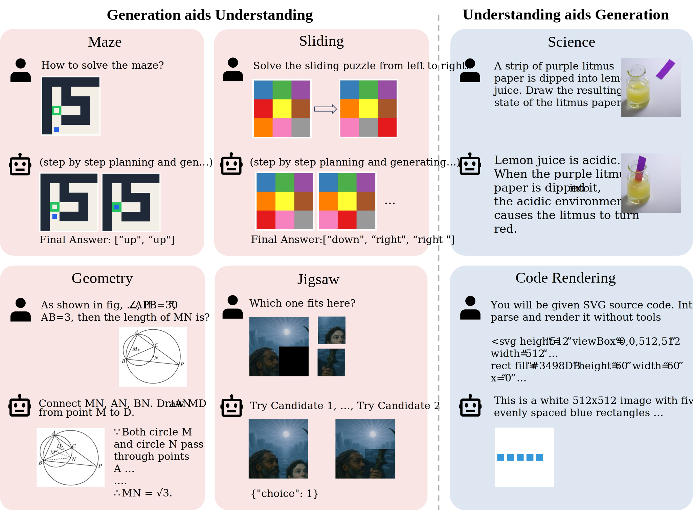

[](https://arxiv.org/abs/xxxx)
[](https://vchitect.github.io/Uni-MMMU-Project/)

<div align="center">
<h1>Uni-MMMU: A Massive Multi-discipline Multimodal Unified Benchmark
</h1></div>

<div align="center">
    <a href="https://github.com/Jacky-hate" target="_blank">Kai Zou</a>*,
    <a href="https://ziqihuangg.github.io/" target="_blank">Ziqi Huang</a>*,
    <a href="https://scholar.google.com/citations?hl=zh-CN&user=kMui170AAAAJ" target="_blank"> Yuhao Dong</a>*,
    <a href="https://shulin16.github.io/" target="_blank">Shulin Tian</a>,
    <a href="https://zhengdian1.github.io/" target="_blank">Dian Zheng</a>,
    <a href="https://github.com/Alexios-hub" target="_blank">Hongbo Liu</a>,
    <a href="https://github.com/hejingwenhejingwen" target="_blank">Jingwen He</a>,
    <a href="https://scholar.google.com/citations?user=kReWULQAAAAJ&hl=en&oi=ao" target="_blank">Bin Liu</a><sup>+</sup>,
    <a href="http://mmlab.siat.ac.cn/yuqiao/index.html" target="_blank">Yu Qiao</a><sup>+</sup>,
    <a href="https://liuziwei7.github.io/" target="_blank">Ziwei Liu</a><sup>+</sup>
</div>

<div align="center">
     * equal contributions &nbsp;&nbsp;&nbsp;&nbsp;&nbsp; 
     + corresponding authors
</div>


<a name="overview"></a>
## :mega: Overview

Unified multimodal models aim to jointly enable visual understanding and generation, yet current benchmarks rarely examine their true integration. Existing evaluations either treat the two abilities in isolation or overlook tasks that inherently couple them. To address this gap, we present \textbf{Uni-MMMU}, a comprehensive and discipline-aware benchmark that systematically unfolds the bidirectional synergy between generation and understanding across eight reasoning-centric domains, including science, coding, mathematics, and puzzles. Each task is \textit{bidirectionally coupled}, demanding models to (i) leverage conceptual understanding to guide precise visual synthesis, or (ii) utilize generation as a cognitive scaffold for analytical reasoning. Uni-MMMU incorporates verifiable intermediate reasoning steps, unique ground truths, and a reproducible scoring protocol for both textual and visual outputs. Through extensive evaluation of state-of-the-art unified, generation-only, and understanding-only models, we reveal substantial performance disparities and cross-modal dependencies, offering new insights into \textit{when and how} these abilities reinforce one another, and establishing a reliable foundation for advancing unified models.




**Overview of Uni-MMMU.** Eight tasks are grouped into two paradigms: generation aids understanding (Maze, Sliding, Geometry, Jigsaw) and understanding guides generation (Science: Physics/Chemistry/Biology; Code Rendering). Each task reports dual-channel scores (text + image).


## Citation

If you find our repo useful for your research, please consider citing our paper:

```bibtex
@InProceedings{zhang2024evaluationagent,
    title = {Evaluation Agent: Efficient and Promptable Evaluation Framework for Visual Generative Models},
    author = {Zhang, Fan and Tian, Shulin and Huang, Ziqi and Qiao, Yu and Liu, Ziwei},
    booktitle={Annual Meeting of the Association for Computational Linguistics (ACL), 2025},
    year = {2024}
}
```

## Related Links

Our related projects: [VBench](https://github.com/Vchitect/VBench), [Awesome Evaluation of Visual Generation](https://github.com/ziqihuangg/Awesome-Evaluation-of-Visual-Generation)

```bibtex
@InProceedings{huang2023vbench,
    title={{VBench}: Comprehensive Benchmark Suite for Video Generative Models},
    author={Huang, Ziqi and He, Yinan and Yu, Jiashuo and Zhang, Fan and Si, Chenyang and Jiang, Yuming and Zhang, Yuanhan and Wu, Tianxing and Jin, Qingyang and Chanpaisit, Nattapol and Wang, Yaohui and Chen, Xinyuan and Wang, Limin and Lin, Dahua and Qiao, Yu and Liu, Ziwei},
    booktitle={Proceedings of the IEEE/CVF Conference on Computer Vision and Pattern Recognition},
    year={2024}
}

@article{huang2024vbench++,
    title={{VBench++}: Comprehensive and Versatile Benchmark Suite for Video Generative Models},
    author={Huang, Ziqi and Zhang, Fan and Xu, Xiaojie and He, Yinan and Yu, Jiashuo and Dong, Ziyue and Ma, Qianli and Chanpaisit, Nattapol and Si, Chenyang and Jiang, Yuming and Wang, Yaohui and Chen, Xinyuan and Chen, Ying-Cong and Wang, Limin and Lin, Dahua and Qiao, Yu and Liu, Ziwei},
    journal={arXiv preprint arXiv:2411.13503},
    year={2024}
}

@article{zheng2025vbench2,
    title={{VBench-2.0}: Advancing Video Generation Benchmark Suite for Intrinsic Faithfulness},
    author={Zheng, Dian and Huang, Ziqi and Liu, Hongbo and Zou, Kai and He, Yinan and Zhang, Fan and Zhang, Yuanhan and He, Jingwen and Zheng, Wei-Shi and Qiao, Yu and Liu, Ziwei},
    journal={arXiv preprint arXiv:2503.21755},
    year={2025}
}
```